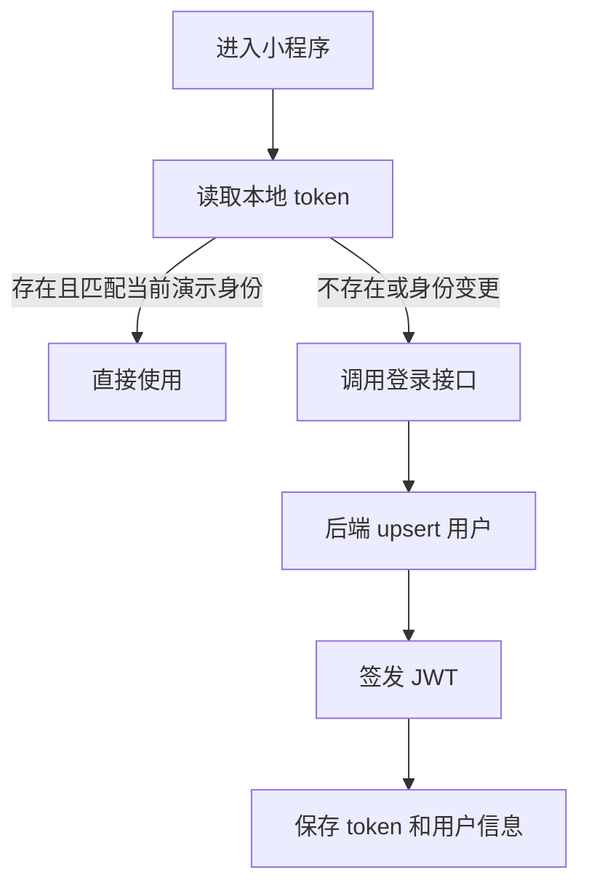
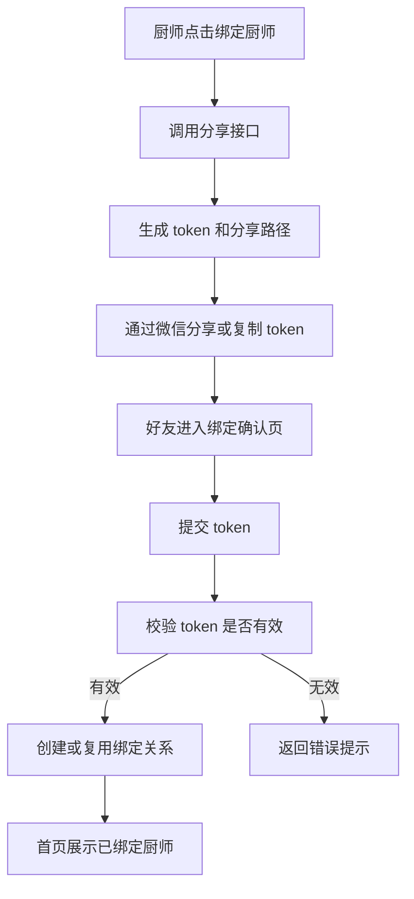
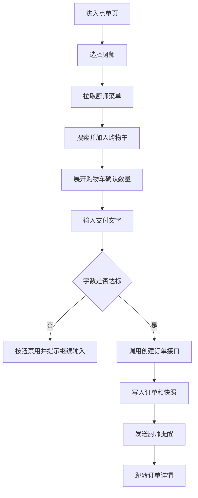

# 文字支付点单小程序需求与功能文档

| 文档版本 | 文档日期 | 文档定位                                           | 适用范围                                           | 说明                                                         |
| -------- | -------- | -------------------------------------------------- | -------------------------------------------------- | ------------------------------------------------------------ |
| V1.0     | 2026.7.9 | 基于当前代码实现整理的需求说明、功能说明与接口文档 | `apps/miniprogram` 小程序前端、`apps/api` 后端服务 | 本文档以当前仓库实现为准，既描述业务目标，也明确当前已实现能力、mock 能力与预留扩展点 |
| v1.1     | 2026.7.9 |                                                    |                                                    | 修改4.2绑定功能。                                            |


## 1. 项目概述

### 1.1 产品定位
“文字支付点单小程序”是一款面向熟人关系或轻私厨场景的微信小程序。用户下单时不支付现金，而是提交满足字数门槛的文字内容，厨师在收到订单后制作菜品并可回复文字，订单完成后用户与厨师双方各可进行 1 次带图评价。

### 1.2 核心差异点
1. 下单支付方式不是金额，而是“达到门槛的文字内容”。
2. 用户与厨师通过分享绑定建立多对多关系。
3. 历史订单保留菜品快照、支付文字、通知状态、厨师回复与评价闭环。
4. 订单数据预留“转手账”结构化快照能力。

### 1.3 当前系统范围
当前系统已覆盖以下能力：
1. 登录与业务身份建立。
2. 厨师绑定分享、确认绑定、解除绑定。
3. 菜单新增、查询、上下架、删除。
4. 点单、购物车、文字支付校验、下单。
5. 微信订阅提醒登记与下单提醒发送。
6. 订单列表、订单详情、厨师完成订单。
7. 双方单次评价与图片上传。
8. 订单转手账的结构化快照预留。

## 2. 角色与使用场景

### 2.1 角色定义
1. 点单用户：浏览已绑定厨师菜单、提交订单、支付文字、查看订单、评价。
2. 厨师：维护菜单、接收订单提醒、完成订单、回复顾客、评价。
3. 演示身份：当前小程序“我的”页面支持切换 `customer_demo`、`chef_demo_a`、`chef_demo_b`，用于本地联调与演示。

### 2.2 典型使用场景
1. 顾客通过首页分享绑定一位厨师。
2. 顾客选择厨师、搜索菜品、加入购物车。
3. 顾客输入满足字数要求的文字并提交订单。
4. 系统通知厨师，厨师查看订单并完成。
5. 双方各自提交一次带图评价。
6. 顾客在订单详情中查看完整闭环记录。

## 3. 当前页面与导航结构

### 3.1 主页面
1. 首页 `pages/home/index`
2. 点单页 `pages/order/index`
3. 订单页 `pages/orders/index`
4. 菜单页 `pages/menu/index`
5. 我的页 `pages/me/index`
6. 菜单新增页 `pages/menu-create/index`
7. 订单详情页 `pages/order-detail/index`
8. 评价页 `pages/review/index`
9. 绑定确认页 `pages/bind-confirm/index`

### 3.2 导航方式
1. 底部 Tab：首页、订单、菜单、我的。
2. 二级页面：点单、菜单新增、订单详情、评价、绑定确认。
3. 首页支持微信分享入口 `open-type="share"`。

## 4. 功能需求说明

### 4.1 登录与身份能力

#### 4.1.1 目标
用户进入系统后需要获得业务登录态，后续请求统一带 JWT Token。

#### 4.1.2 当前实现
1. 后端提供 `POST /api/v1/auth/login`。
2. 当前默认开启 mock 微信登录，允许以 `mockOpenId` 直接创建或更新用户。
3. 返回 `accessToken` 与用户信息。
4. 小程序端默认通过演示身份登录，不依赖真实微信 code 换 openid。

#### 4.1.3 规则
1. `code` 必填。
2. `nickname`、`avatarUrl`、`mockOpenId` 选填。
3. 若关闭 mock 微信登录且未接入真实微信换 openid，接口会拒绝登录。

#### 4.1.4 功能流程


### 4.2 绑定顾客

#### 4.2.1 目标
顾客与厨师建立多对多绑定关系，顾客只可对已绑定厨师下单。

#### 4.2.2 当前实现
1. 厨师可生成短 token 分享链接。
2. 好友进入绑定确认页后提交 token 即建立绑定，此时提交token的还有在绑定中的角色是顾客，token生成者的角色是厨师。
3. 当前后端 token 长度为 6 位。
4. 厨师与顾客可存在多对多关系。
5. 顾客和厨师均可在“我的”页面解除绑定。

#### 4.2.3 规则
1. 不允许绑定自己。
2. token 必须存在且有效。
3. 同一顾客和同一厨师重复绑定时使用幂等 upsert，不会创建重复关系。
4. 删除绑定按 `customerId + chefId` 删除。

#### 4.2.4 功能流程


### 4.3 菜单管理

#### 4.3.1 目标
厨师维护自己的菜品信息，为顾客点单提供数据源。

#### 4.3.2 当前实现
1. 查看菜品列表。
2. 新增菜品。
3. 删除菜品。
4. 上下架菜品。
5. 后端支持完整更新菜品 `PATCH /menus/:id`，当前小程序前端暂未暴露编辑表单。

#### 4.3.3 菜品字段
1. `imageUrl`：菜品图片地址，可为空。
2. `name`：菜品名称。
3. `description`：菜品描述，可为空。
4. `textPrice`：文字价格，即下单所需字数。
5. `status`：`active` 或 `inactive`。
6. `sortOrder`：排序值。

#### 4.3.4 业务规则
1. `textPrice` 必须大于等于 1。
2. 菜品只允许所有者厨师操作。
3. 已下架菜品不能被新订单下单。
4. 历史订单读取快照，不受菜品后续修改或删除影响。

#### 4.3.5 功能流程
1. 厨师进入菜单页。
2. 查看自己名下菜品列表。
3. 点击“添加菜品”进入新增页。
4. 填写菜品信息并上传图片。
5. 保存后返回菜单页。
6. 可继续执行上下架和删除。

### 4.4 点单与文字支付

#### 4.4.1 目标
顾客选择绑定厨师、选择菜品、输入满足门槛的文字内容并完成下单。

#### 4.4.2 当前实现
1. 点单前先选择 1 位绑定厨师。
2. 菜品列表支持关键字搜索。
3. 菜品支持加购、减购，数量为 0 时从购物车移除。
4. 底部悬浮购物车展示总菜品数量和总字数要求。
5. 展开购物车后可直接编辑数量。
6. 文字输入框实时统计有效字数。
7. 字数不足时下单按钮禁用。

#### 4.4.3 字数统计规则
1. 使用 `countMeaningfulChars` 统计字数。
2. 当前规则为：去掉所有空白字符后计数。
3. 总要求字数 = 每个菜品 `textPrice * quantity` 之和。
4. 实际字数 < 总要求字数时，不允许下单。

#### 4.4.4 下单规则
1. 购物车不能为空。
2. 顾客必须与厨师存在绑定关系。
3. 只能下单状态为 `active` 的菜品。
4. 下单成功后写入订单、订单菜品快照、手账快照。
5. 下单成功后触发通知逻辑。

#### 4.4.5 功能流程


### 4.5 订单查看

#### 4.5.1 目标
顾客和厨师都能查看与自己相关的订单。

#### 4.5.2 当前实现
1. 订单页支持按角色切换。
2. `customer` 视角查看自己下的订单。
3. `chef` 视角查看自己收到的订单。
4. 可按时间倒序查看订单。
5. 点击订单进入详情页。

#### 4.5.3 状态定义
1. `pending`：待制作。
2. `completed`：已完成。
3. `notifyStatus=sent`：已通知厨师。
4. `notifyStatus=fallback`：未开启微信提醒，已站内提醒。
5. `notifyStatus=failed`：提醒失败。

### 4.6 厨师完成订单

#### 4.6.1 目标
厨师处理接收到的订单并在完成时可给顾客附加回复。

#### 4.6.2 当前实现
1. 只有订单所属厨师才能完成订单。
2. 厨师可填写可选 `chefReply`。
3. 完成后订单状态改为 `completed`。
4. 同时更新 `JournalSnapshot` 的完成信息。

#### 4.6.3 业务规则
1. 已完成订单不可重复完成。
2. 非订单厨师无权完成订单。
3. 订单不存在时返回错误。

### 4.7 双方评价

#### 4.7.1 目标
订单完成后，顾客与厨师各可以评价一次。

#### 4.7.2 当前实现
1. 仅已完成订单可评价。
2. 顾客与厨师各只能提交 1 次。
3. 支持文字评价。
4. 支持附加 1 张图片。

#### 4.7.3 业务规则
1. 非订单参与方不能评价。
2. 同一角色重复评价会被拒绝。
3. 评价记录写入 `Review` 表，唯一约束为 `orderId + reviewerRole`。

### 4.8 图片上传

#### 4.8.1 目标
为菜品与评价提供图片上传能力。

#### 4.8.2 当前实现
1. 小程序通过 `wx.uploadFile` 上传文件。
2. 后端使用 Fastify multipart 接收文件。
3. 文件存储到 MinIO。
4. 上传成功后返回可访问 URL，并写入 `FileAsset`。

#### 4.8.3 规则
1. 单文件上传。
2. 文件大小上限 10MB。
3. 文件内容不能为空。
4. 当前返回的是带签名的 URL，有效期 7 天。

### 4.9 通知能力

#### 4.9.1 目标
顾客下单后提醒厨师查看新订单。

#### 4.9.2 当前实现
1. 厨师可登记订阅消息模板。
2. 下单后调用通知服务。
3. 若厨师存在已接受订阅，则调用微信通知 Provider。
4. 当前 `WechatNotificationProvider` 为 mock 实现，返回 `sent`。
5. 若厨师未登记订阅，则回退为 `fallback`，并记录站内提醒事件。

#### 4.9.3 业务规则
1. 订阅记录唯一键：`userId + templateId`。
2. 订阅状态当前支持 `accepted`、`revoked`。
3. 通知结果写回订单字段 `notifyStatus`。
4. 系统会额外写入 `OutboxEvent` 事件。

### 4.10 手账预留

#### 4.10.1 目标
为后续“订单转手账”提供结构化数据基础。

#### 4.10.2 当前实现
1. 订单创建时会写入 `JournalSnapshot`。
2. 快照中包含订单 ID、创建时间、厨师 ID、菜品快照、支付文字。
3. 订单完成后补充 `completedAt` 与 `chefReply`。
4. 当前未提供前台手账转换入口，但后端数据结构已预留。

## 5. 数据模型摘要

### 5.1 User
- 用途：用户主体。
- 关键字段：`id`、`openId`、`nickname`、`avatarUrl`。

### 5.2 Binding
- 用途：顾客与厨师绑定关系。
- 关键字段：`customerId`、`chefId`、`status`。
- 约束：`customerId + chefId` 唯一。

### 5.3 BindingShareLink
- 用途：厨师绑定分享链接。
- 关键字段：`chefId`、`token`、`isActive`。

### 5.4 MenuItem
- 用途：菜品。
- 关键字段：`chefId`、`name`、`description`、`imageUrl`、`textPrice`、`status`、`sortOrder`。

### 5.5 Order
- 用途：订单主表。
- 关键字段：`customerId`、`chefId`、`status`、`notifyStatus`、`requiredTextCount`、`paymentText`、`chefReply`。

### 5.6 OrderItemSnapshot
- 用途：订单菜品快照。
- 关键字段：`menuItemId`、`name`、`description`、`imageUrl`、`textPrice`、`quantity`。

### 5.7 Review
- 用途：订单评价。
- 关键字段：`orderId`、`reviewerId`、`reviewerRole`、`content`、`imageUrl`。
- 约束：`orderId + reviewerRole` 唯一。

### 5.8 FileAsset
- 用途：上传文件记录。
- 关键字段：`ownerId`、`storageKey`、`url`、`mimeType`、`size`。

### 5.9 NotificationSubscription
- 用途：消息订阅记录。
- 关键字段：`userId`、`templateId`、`status`。

### 5.10 JournalSnapshot
- 用途：订单转手账预留结构化快照。
- 关键字段：`orderId`、`customerId`、`structuredData`、`status`。

### 5.11 OutboxEvent
- 用途：领域事件与异步扩展记录。
- 关键字段：`topic`、`payload`、`status`。

## 6. 接口总览

- 接口前缀：`/api/v1`
- 认证方式：`Authorization: Bearer <accessToken>`
- 响应风格：当前多数接口直接返回资源对象，不包裹统一 `data` 外层
- 错误风格：NestJS 默认错误结构，典型字段为 `statusCode`、`message`、`error`

### 6.1 认证接口

#### 6.1.1 登录
- 方法：`POST /api/v1/auth/login`
- 说明：mock 微信登录或真实登录入口。

请求示例：
```json
{
  "code": "demo-customer_demo",
  "nickname": "今天想吃饭",
  "mockOpenId": "customer_demo"
}
```

响应示例：
```json
{
  "accessToken": "eyJhbGciOiJIUzI1NiIsInR5cCI6IkpXVCJ9...",
  "refreshToken": "eyJhbGciOiJIUzI1NiIsInR5cCI6IkpXVCJ9...",
  "user": {
    "id": "cmc_user_customer_demo",
    "openId": "customer_demo",
    "nickname": "今天想吃饭",
    "avatarUrl": "https://placehold.co/120x120/png?text=C",
    "bio": null,
    "createdAt": "2026-07-09T09:00:00.000Z",
    "updatedAt": "2026-07-09T09:00:00.000Z"
  }
}
```

### 6.2 用户接口

#### 6.2.1 获取当前用户信息
- 方法：`GET /api/v1/me`
- 说明：返回基础信息、绑定关系与订阅信息。

响应示例：
```json
{
  "id": "cmc_user_customer_demo",
  "openId": "customer_demo",
  "nickname": "今天想吃饭",
  "avatarUrl": "https://placehold.co/120x120/png?text=C",
  "bindings": {
    "asCustomer": [
      {
        "id": "bind_001",
        "chefId": "cmc_user_chef_a",
        "chefName": "阿棕",
        "chefAvatarUrl": "https://placehold.co/120x120/png?text=A"
      }
    ],
    "asChef": []
  },
  "subscriptions": []
}
```

### 6.3 绑定接口

#### 6.3.1 获取绑定列表
- 方法：`GET /api/v1/bindings`

响应示例：
```json
{
  "asCustomer": [
    {
      "id": "bind_001",
      "customerId": "cmc_user_customer_demo",
      "chefId": "cmc_user_chef_a",
      "status": "active",
      "createdAt": "2026-07-09T09:10:00.000Z",
      "updatedAt": "2026-07-09T09:10:00.000Z",
      "chef": {
        "id": "cmc_user_chef_a",
        "openId": "chef_demo_a",
        "nickname": "阿棕",
        "avatarUrl": "https://placehold.co/120x120/png?text=A"
      }
    }
  ],
  "asChef": [],
  "shareLinks": [
    {
      "id": "share_001",
      "chefId": "cmc_user_customer_demo",
      "token": "A1B2C3",
      "isActive": true,
      "createdAt": "2026-07-09T09:20:00.000Z",
      "miniProgramPath": "/pages/bind-confirm/index?token=A1B2C3"
    }
  ]
}
```

#### 6.3.2 生成分享绑定链接
- 方法：`POST /api/v1/bindings/share`
- 请求体：空对象 `{}`

响应示例：
```json
{
  "id": "share_001",
  "chefId": "cmc_user_chef_a",
  "token": "A1B2C3",
  "isActive": true,
  "createdAt": "2026-07-09T09:20:00.000Z",
  "miniProgramPath": "/pages/bind-confirm/index?token=A1B2C3",
  "shareTitle": "和我绑定厨师，一起用文字点单吧",
  "shareDescription": "打开小程序确认绑定后，就能开始点单和接单。",
  "mockShareMessage": "把这张小饭卡分享给好友，确认后就能绑定啦。"
}
```

#### 6.3.3 确认绑定
- 方法：`POST /api/v1/bindings/confirm`

请求示例：
```json
{
  "token": "A1B2C3"
}
```

响应示例：
```json
{
  "binding": {
    "id": "bind_002",
    "customerId": "cmc_user_customer_demo",
    "chefId": "cmc_user_chef_b",
    "status": "active",
    "createdAt": "2026-07-09T09:30:00.000Z",
    "updatedAt": "2026-07-09T09:30:00.000Z",
    "chef": {
      "id": "cmc_user_chef_b",
      "openId": "chef_demo_b",
      "nickname": "小桃",
      "avatarUrl": "https://placehold.co/120x120/png?text=B"
    }
  },
  "message": "已绑定厨师 小桃"
}
```

#### 6.3.4 删除绑定
- 方法：`DELETE /api/v1/bindings/:chefId`

响应示例：
```json
{
  "deleted": true
}
```

### 6.4 菜单接口

#### 6.4.1 获取菜单列表
- 方法：`GET /api/v1/menus?chefId=<chefId>`

响应示例：
```json
[
  {
    "id": "demo_chef_a_tomato_beef_rice",
    "chefId": "cmc_user_chef_a",
    "imageUrl": "https://placehold.co/300x200/png?text=%E7%95%AA%E8%8C%84%E7%89%9B%E8%85%A9",
    "name": "番茄牛腩饭",
    "description": "酸甜软烂，适合认真写信时吃。",
    "textPrice": 28,
    "status": "active",
    "sortOrder": 0,
    "createdAt": "2026-07-09T09:00:00.000Z",
    "updatedAt": "2026-07-09T09:00:00.000Z"
  }
]
```

#### 6.4.2 新增菜品
- 方法：`POST /api/v1/menus`

请求示例：
```json
{
  "name": "焦糖布丁",
  "description": "像回信一样温柔的甜点。",
  "imageUrl": "https://cdn.example.com/files/pudding.png",
  "textPrice": 16,
  "sortOrder": 1
}
```

响应示例：
```json
{
  "id": "menu_001",
  "chefId": "cmc_user_chef_a",
  "imageUrl": "https://cdn.example.com/files/pudding.png",
  "name": "焦糖布丁",
  "description": "像回信一样温柔的甜点。",
  "textPrice": 16,
  "status": "active",
  "sortOrder": 1,
  "createdAt": "2026-07-09T09:40:00.000Z",
  "updatedAt": "2026-07-09T09:40:00.000Z"
}
```

#### 6.4.3 更新菜品
- 方法：`PATCH /api/v1/menus/:id`
- 说明：后端已支持，当前前端未直接调用。

请求示例：
```json
{
  "description": "升级后的奶香版本",
  "textPrice": 18
}
```

响应示例：
```json
{
  "id": "menu_001",
  "chefId": "cmc_user_chef_a",
  "imageUrl": "https://cdn.example.com/files/pudding.png",
  "name": "焦糖布丁",
  "description": "升级后的奶香版本",
  "textPrice": 18,
  "status": "active",
  "sortOrder": 1,
  "createdAt": "2026-07-09T09:40:00.000Z",
  "updatedAt": "2026-07-09T10:00:00.000Z"
}
```

#### 6.4.4 修改菜品状态
- 方法：`PATCH /api/v1/menus/:id/status`

请求示例：
```json
{
  "status": "inactive"
}
```

响应示例：
```json
{
  "id": "menu_001",
  "status": "inactive"
}
```

#### 6.4.5 删除菜品
- 方法：`DELETE /api/v1/menus/:id`

响应示例：
```json
{
  "deleted": true
}
```

### 6.5 订单接口

#### 6.5.1 创建订单
- 方法：`POST /api/v1/orders`

请求示例：
```json
{
  "chefId": "cmc_user_chef_a",
  "items": [
    {
      "menuItemId": "demo_chef_a_tomato_beef_rice",
      "quantity": 1
    },
    {
      "menuItemId": "demo_chef_a_caramel_pudding",
      "quantity": 2
    }
  ],
  "paymentText": "今天特别想吃热乎一点的饭，也想用这顿饭奖励一下认真工作的自己。"
}
```

响应示例：
```json
{
  "id": "order_001",
  "customerId": "cmc_user_customer_demo",
  "chefId": "cmc_user_chef_a",
  "status": "pending",
  "notifyStatus": "sent",
  "requiredTextCount": 60,
  "paymentText": "今天特别想吃热乎一点的饭，也想用这顿饭奖励一下认真工作的自己。",
  "chefReply": null,
  "completedAt": null,
  "createdAt": "2026-07-09T10:10:00.000Z",
  "updatedAt": "2026-07-09T10:10:00.000Z",
  "items": [
    {
      "id": "snapshot_001",
      "orderId": "order_001",
      "menuItemId": "demo_chef_a_tomato_beef_rice",
      "name": "番茄牛腩饭",
      "description": "酸甜软烂，适合认真写信时吃。",
      "imageUrl": "https://placehold.co/300x200/png?text=%E7%95%AA%E8%8C%84%E7%89%9B%E8%85%A9",
      "textPrice": 28,
      "quantity": 1,
      "createdAt": "2026-07-09T10:10:00.000Z"
    },
    {
      "id": "snapshot_002",
      "orderId": "order_001",
      "menuItemId": "demo_chef_a_caramel_pudding",
      "name": "焦糖布丁",
      "description": "像回信一样温柔的甜点。",
      "imageUrl": "https://placehold.co/300x200/png?text=%E5%B8%83%E4%B8%81",
      "textPrice": 16,
      "quantity": 2,
      "createdAt": "2026-07-09T10:10:00.000Z"
    }
  ],
  "reviews": [],
  "customer": {
    "id": "cmc_user_customer_demo",
    "nickname": "今天想吃饭"
  },
  "chef": {
    "id": "cmc_user_chef_a",
    "nickname": "阿棕"
  },
  "journalSnapshot": {
    "id": "journal_001",
    "orderId": "order_001",
    "customerId": "cmc_user_customer_demo",
    "status": "pending",
    "structuredData": {
      "orderId": "order_001",
      "chefId": "cmc_user_chef_a",
      "items": [
        {
          "menuItemId": "demo_chef_a_tomato_beef_rice",
          "name": "番茄牛腩饭",
          "textPrice": 28,
          "quantity": 1
        }
      ],
      "paymentText": "今天特别想吃热乎一点的饭，也想用这顿饭奖励一下认真工作的自己。"
    },
    "createdAt": "2026-07-09T10:10:00.000Z",
    "updatedAt": "2026-07-09T10:10:00.000Z"
  }
}
```

#### 6.5.2 获取订单列表
- 方法：`GET /api/v1/orders?role=customer|chef|all&status=pending|completed`

请求示例：
```http
GET /api/v1/orders?role=chef&status=pending
```

响应示例：
```json
[
  {
    "id": "order_001",
    "customerId": "cmc_user_customer_demo",
    "chefId": "cmc_user_chef_a",
    "status": "pending",
    "notifyStatus": "sent",
    "requiredTextCount": 60,
    "paymentText": "今天特别想吃热乎一点的饭，也想用这顿饭奖励一下认真工作的自己。",
    "chefReply": null,
    "completedAt": null,
    "createdAt": "2026-07-09T10:10:00.000Z",
    "updatedAt": "2026-07-09T10:10:00.000Z",
    "items": [
      {
        "id": "snapshot_001",
        "name": "番茄牛腩饭",
        "textPrice": 28,
        "quantity": 1
      }
    ],
    "reviews": [],
    "customer": {
      "id": "cmc_user_customer_demo",
      "nickname": "今天想吃饭"
    },
    "chef": {
      "id": "cmc_user_chef_a",
      "nickname": "阿棕"
    }
  }
]
```

#### 6.5.3 获取订单详情
- 方法：`GET /api/v1/orders/:id`

响应示例：
```json
{
  "id": "order_001",
  "customerId": "cmc_user_customer_demo",
  "chefId": "cmc_user_chef_a",
  "status": "completed",
  "notifyStatus": "sent",
  "requiredTextCount": 60,
  "paymentText": "今天特别想吃热乎一点的饭，也想用这顿饭奖励一下认真工作的自己。",
  "chefReply": "收到啦，已经帮你做好，记得趁热吃。",
  "completedAt": "2026-07-09T11:00:00.000Z",
  "createdAt": "2026-07-09T10:10:00.000Z",
  "updatedAt": "2026-07-09T11:00:00.000Z",
  "items": [
    {
      "id": "snapshot_001",
      "orderId": "order_001",
      "menuItemId": "demo_chef_a_tomato_beef_rice",
      "name": "番茄牛腩饭",
      "description": "酸甜软烂，适合认真写信时吃。",
      "imageUrl": "https://placehold.co/300x200/png?text=%E7%95%AA%E8%8C%84%E7%89%9B%E8%85%A9",
      "textPrice": 28,
      "quantity": 1,
      "createdAt": "2026-07-09T10:10:00.000Z"
    }
  ],
  "reviews": [
    {
      "id": "review_001",
      "orderId": "order_001",
      "reviewerId": "cmc_user_customer_demo",
      "reviewerRole": "customer",
      "content": "番茄牛腩很软烂，文字支付这个过程也很有仪式感。",
      "imageUrl": "https://cdn.example.com/files/review-1.png",
      "createdAt": "2026-07-09T11:10:00.000Z",
      "updatedAt": "2026-07-09T11:10:00.000Z"
    }
  ],
  "customer": {
    "id": "cmc_user_customer_demo",
    "nickname": "今天想吃饭"
  },
  "chef": {
    "id": "cmc_user_chef_a",
    "nickname": "阿棕"
  },
  "journalSnapshot": {
    "id": "journal_001",
    "orderId": "order_001",
    "customerId": "cmc_user_customer_demo",
    "status": "generated",
    "structuredData": {
      "orderId": "order_001",
      "createdAt": "2026-07-09T10:10:00.000Z",
      "chefId": "cmc_user_chef_a",
      "paymentText": "今天特别想吃热乎一点的饭，也想用这顿饭奖励一下认真工作的自己。",
      "completedAt": "2026-07-09T11:00:00.000Z",
      "chefReply": "收到啦，已经帮你做好，记得趁热吃。"
    },
    "createdAt": "2026-07-09T10:10:00.000Z",
    "updatedAt": "2026-07-09T11:00:00.000Z"
  }
}
```

#### 6.5.4 完成订单
- 方法：`PATCH /api/v1/orders/:id/complete`

请求示例：
```json
{
  "chefReply": "收到啦，已经帮你做好，记得趁热吃。"
}
```

响应示例：
```json
{
  "id": "order_001",
  "status": "completed",
  "chefReply": "收到啦，已经帮你做好，记得趁热吃。",
  "completedAt": "2026-07-09T11:00:00.000Z"
}
```

### 6.6 评价接口

#### 6.6.1 创建评价
- 方法：`POST /api/v1/reviews`

请求示例：
```json
{
  "orderId": "order_001",
  "content": "番茄牛腩很软烂，文字支付这个过程也很有仪式感。",
  "imageUrl": "https://cdn.example.com/files/review-1.png"
}
```

响应示例：
```json
{
  "id": "review_001",
  "orderId": "order_001",
  "reviewerId": "cmc_user_customer_demo",
  "reviewerRole": "customer",
  "content": "番茄牛腩很软烂，文字支付这个过程也很有仪式感。",
  "imageUrl": "https://cdn.example.com/files/review-1.png",
  "createdAt": "2026-07-09T11:10:00.000Z",
  "updatedAt": "2026-07-09T11:10:00.000Z"
}
```

### 6.7 文件接口

#### 6.7.1 上传图片
- 方法：`POST /api/v1/files/upload`
- Content-Type：`multipart/form-data`
- 文件字段名：`file`

响应示例：
```json
{
  "id": "file_001",
  "ownerId": "cmc_user_chef_a",
  "storageKey": "cmc_user_chef_a/550e8400-e29b-41d4-a716-446655440000.png",
  "url": "http://localhost:9000/word-order/...signed-url...",
  "mimeType": "image/png",
  "size": 245123,
  "createdAt": "2026-07-09T09:45:00.000Z"
}
```

### 6.8 通知接口

#### 6.8.1 记录消息订阅
- 方法：`POST /api/v1/notifications/subscribe`

请求示例：
```json
{
  "templateId": "tmpl_demo"
}
```

响应示例：
```json
{
  "id": "sub_001",
  "userId": "cmc_user_chef_a",
  "templateId": "tmpl_demo",
  "status": "accepted",
  "acceptedAt": "2026-07-09T09:00:00.000Z",
  "updatedAt": "2026-07-09T09:00:00.000Z"
}
```

## 7. 错误示例

### 7.1 字数不足
```json
{
  "statusCode": 400,
  "message": "当前文字数量不足，需要至少 60 个字。",
  "error": "Bad Request"
}
```

### 7.2 未绑定厨师直接下单
```json
{
  "statusCode": 403,
  "message": "请先绑定厨师再下单",
  "error": "Forbidden"
}
```

### 7.3 已完成订单重复评价
```json
{
  "statusCode": 400,
  "message": "该角色已经评价过一次了",
  "error": "Bad Request"
}
```

## 8. 页面功能与接口映射

| 页面 | 主要动作 | 对应接口 |
| --- | --- | --- |
| 首页 | 登录初始化、获取绑定、生成分享、复制 token | `POST /auth/login` `GET /me` `GET /bindings` `POST /bindings/share` |
| 绑定确认页 | 提交 token 建立绑定 | `POST /bindings/confirm` |
| 点单页 | 获取菜单、创建订单 | `GET /me` `GET /menus` `POST /orders` |
| 订单页 | 按角色查看订单列表 | `GET /orders` |
| 订单详情页 | 获取详情、完成订单 | `GET /orders/:id` `PATCH /orders/:id/complete` |
| 菜单页 | 查询、上下架、删除 | `GET /menus` `PATCH /menus/:id/status` `DELETE /menus/:id` |
| 添加菜品页 | 上传图片、创建菜品 | `POST /files/upload` `POST /menus` |
| 评价页 | 上传图片、提交评价 | `POST /files/upload` `POST /reviews` |
| 我的页 | 获取用户信息、切换演示身份、删除绑定、记录订阅 | `GET /me` `DELETE /bindings/:chefId` `POST /notifications/subscribe` |

## 9. 关键业务流程汇总

### 9.1 顾客首次下单闭环
1. 顾客进入首页并自动登录。
2. 顾客点击“绑定厨师”，生成分享 token。
3. 厨师或好友通过分享链接进入绑定确认页。
4. 顾客进入点单页，选择已绑定厨师。
5. 搜索菜品并加入购物车。
6. 在购物车中调整数量。
7. 输入满足字数要求的文字并提交订单。
8. 系统创建订单、菜品快照、手账快照并发送提醒。
9. 顾客跳转订单详情等待处理。
10. 厨师在订单详情完成订单并回复。
11. 双方各自提交一次带图评价。
12. 顾客在订单详情查看完整闭环。

### 9.2 厨师菜单维护流程
1. 厨师进入菜单页。
2. 查看当前菜品列表。
3. 点击“添加菜品”。
4. 上传图片并填写名称、描述、字数价格。
5. 保存菜品。
6. 视需要执行上下架或删除。

### 9.3 通知处理流程
1. 厨师在“我的”页面记录订阅模板。
2. 顾客创建订单。
3. 订单服务调用通知服务。
4. 若存在有效订阅，则调用微信通知 Provider。
5. 当前 provider mock 返回 `sent`。
6. 若没有订阅，则记录 `fallback` 并写入事件表。

## 10. 当前实现限制与后续建议

### 10.1 当前实现限制
1. 当前登录仍是 mock 微信登录，尚未接入真实 `wx.login + code2Session`。
2. 微信订阅消息 Provider 目前为 mock 实现，尚未调用真实微信订阅消息 API。
3. 菜单编辑接口已存在，但前端仅提供新增、上下架、删除入口。
4. 当前接口响应未统一封装，前后端采用“直接返回资源对象”风格。
5. 前端部分文案文件曾出现编码问题，维护时需统一使用 UTF-8 无 BOM。

### 10.2 后续建议
1. 接入真实微信登录能力。
2. 接入真实微信订阅消息发送。
3. 补齐菜单编辑页与排序能力。
4. 增加订单筛选、搜索与分页。
5. 补充后台管理能力。
6. 基于 `JournalSnapshot` 增加“转手账”页面与导出能力。

## 11. 文档结论
当前系统已经具备“文字支付点单”主闭环的正式实现基础，核心业务包括绑定、菜单、点单、通知、订单、完成、评价与文件上传均已具备可运行接口和前端页面。后续如果需要进入上线准备阶段，建议优先补齐真实微信登录、真实订阅消息和编码统一治理。